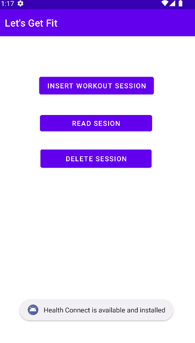
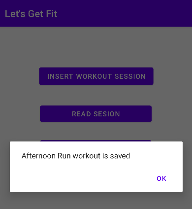
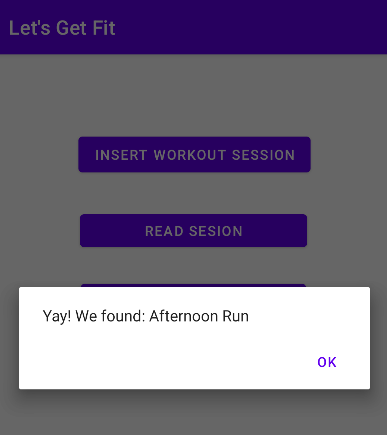
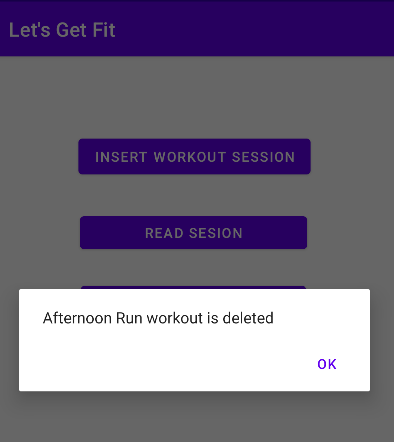

# Health Connect Sample

This repository contains a sample to help you get started writing Health Connect apps for Android.

Before you begin, make sure you have the Health Connect App installed and your device is API 28 or higher https://developer.android.com/guide/health-and-fitness/health-connect/get-started#resources

## Screenshots

   

